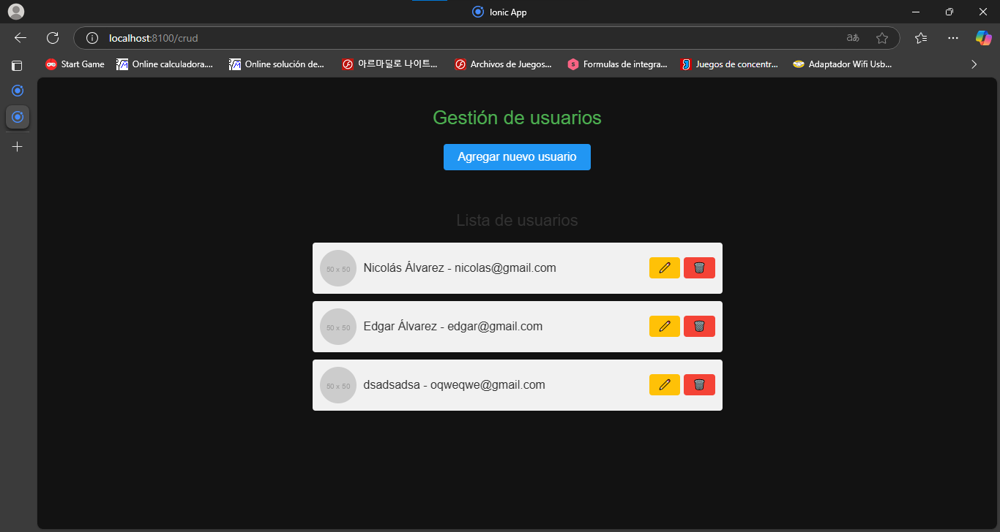

# Captura de funcionamiento
## Es una herramienta para gestionar una lista de usuarios básica en cualquier aplicación o sistema, permitiendo mantener actualizada la información de cada usuario (como nombre y correo electrónico) y eliminarlos cuando sea necesario.
# 1. Agregar usuario.

# 2. Se ingresa nombre y correo, luego clic en agregar.

# 3. Se revisa que esté agregado y efectivamente lo está.

# 4. Se da clic en el botón amarillo que tiene un ícono de lápiz para editar el registro.

# 5. Se cambian los datos y una vez se modifiquen se da clic en el botón actualizar.

# 6. Si se modificó con éxito.

# 7. Ahora por último se borró el último dato que había, dando clic en el botón rojo con un ícono de cesto de basura.

