# Manual de Componentes en Ionic Vue
## Ejemplo de 10 Componentes

```vue
<template>
  <ion-app>
    <!-- Encabezado Principal -->
    <ion-header>
      <ion-toolbar color="primary">
        <ion-title>Ejemplo de Componentes en Ionic Vue</ion-title>
      </ion-toolbar>
    </ion-header>

    <ion-content class="ion-padding">

      <!-- Componente de Alerta -->
      <ion-card>
        <ion-card-header>
          <ion-card-title>Mostrar Alerta</ion-card-title>
        </ion-card-header>
        <ion-card-content>
          <ion-button expand="full" color="warning" @click="mostrarAlerta">
            Alerta
          </ion-button>
        </ion-card-content>
      </ion-card>


      <!-- Componente de Checkbox -->
      <ion-card>
        <ion-card-header>
          <ion-card-title>Seleccionar Preferencias</ion-card-title>
        </ion-card-header>
        <ion-card-content>
          <ion-item>
            <ion-label>Opción 1</ion-label>
            <ion-checkbox slot="end" v-model="opcion1"></ion-checkbox>
          </ion-item>
          <ion-item>
            <ion-label>Opción 2</ion-label>
            <ion-checkbox slot="end" v-model="opcion2"></ion-checkbox>
          </ion-item>
        </ion-card-content>
      </ion-card>

      <!-- Otros componentes similares -->
    </ion-content>
  </ion-app>
</template>

<script setup>
import { ref } from 'vue';
import { alertController, toastController } from '@ionic/vue';

// Estado de los componentes
const opcion1 = ref(false);
const opcion2 = ref(false);
const fechaSeleccionada = ref('');
const genero = ref('');
const volumen = ref(50);
const paisSeleccionado = ref('');
const categoriaSeleccionada = ref('Noticias');
const modoOscuro = ref(false);

// Función para mostrar una alerta
const mostrarAlerta = async () => {
  const alert = await alertController.create({
    header: 'Alerta',
    message: 'Este es un mensaje de alerta',
    buttons: ['OK']
  });
  await alert.present();
};

// Función para mostrar una notificación (Toast)
const mostrarNotificacion = async () => {
  const toast = await toastController.create({
    message: 'Notificación enviada con éxito',
    duration: 2000,
    position: 'top'
  });
  await toast.present();
};
</script>

<style scoped>
/* Estilos personalizados */
.ion-padding {
  padding: 16px;
}
</style>
```

---

## Explicación de los Componentes

### 1. **Alerta**
- Un botón que muestra una alerta al ser presionado.
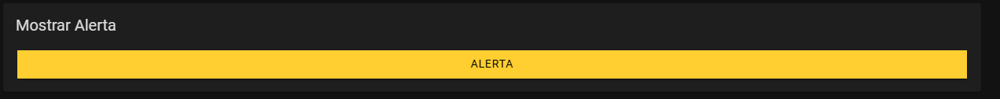
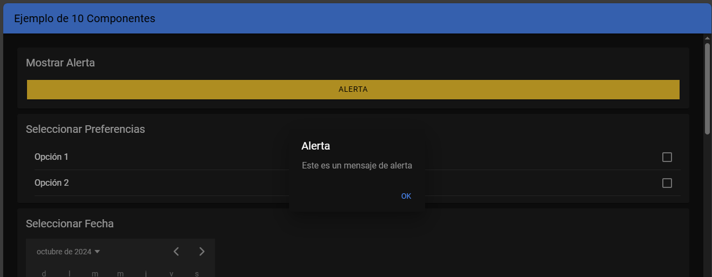
### 2. **Checkbox**
- Dos opciones que el usuario puede seleccionar o deseleccionar.
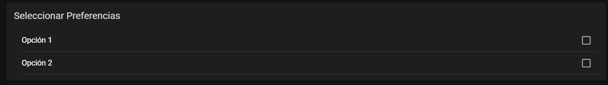
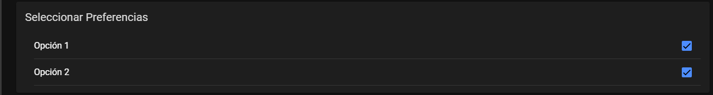
### 3. **Fecha (Date Picker)**
- Un selector de fecha con formato `DD/MM/YYYY`.
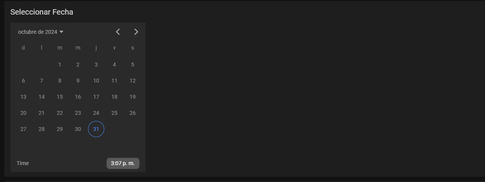
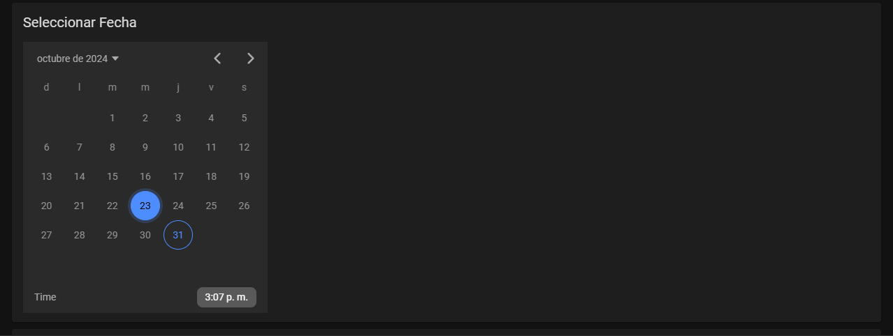
### 4. **Radio Button**
- Permite seleccionar un solo valor de "Masculino" o "Femenino".
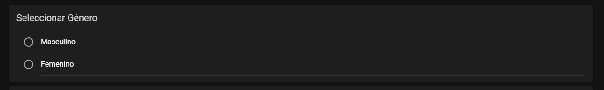
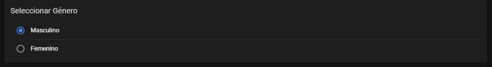
### 5. **Rango (Slider)**
- Un control deslizante para ajustar el volumen de 0 a 100.
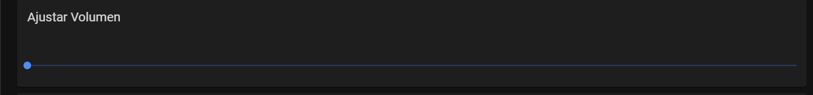
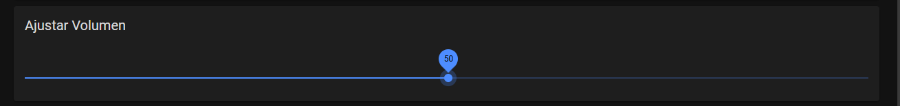
### 6. **Select**
- Un desplegable para seleccionar un país.
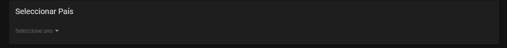
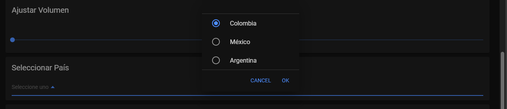
### 7. **Segmento**
- Tres botones para seleccionar una categoría: "Noticias", "Deportes", "Entretenimiento".
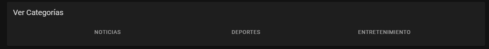
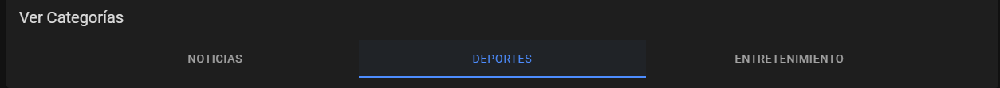
### 8. **Spinner (Cargando)**
- Muestra un icono de carga en estilo crescent.
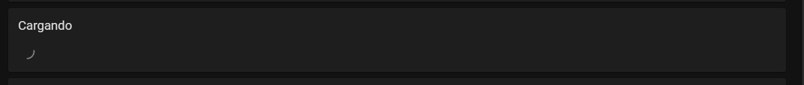
### 9. **Toggle (Modo Oscuro)**
- Un interruptor para activar o desactivar el modo oscuro.
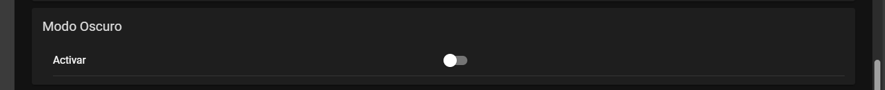
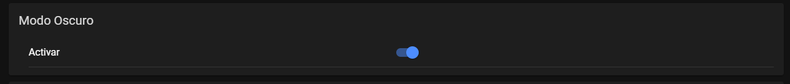
### 10. **Toast (Notificación)**
- Un botón que muestra una notificación al ser presionado.
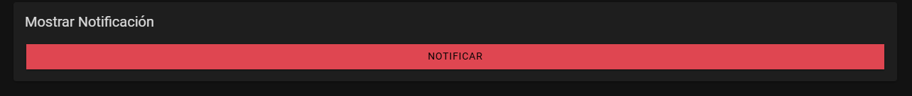
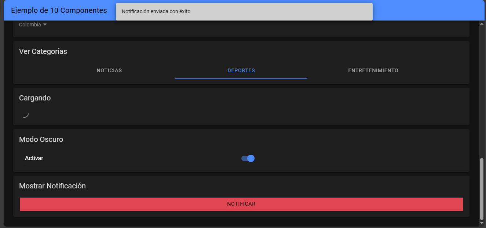
### **Vista completa**
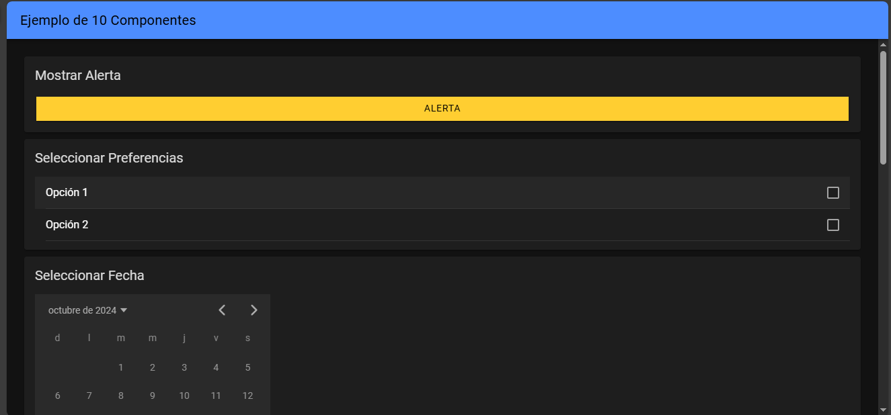
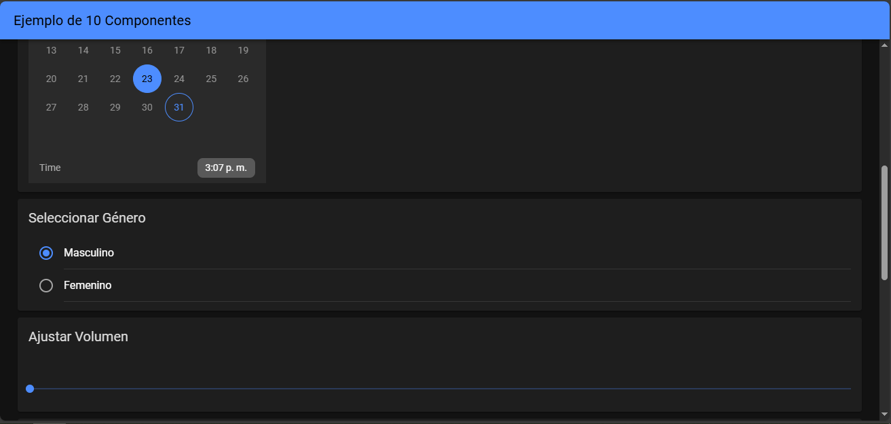
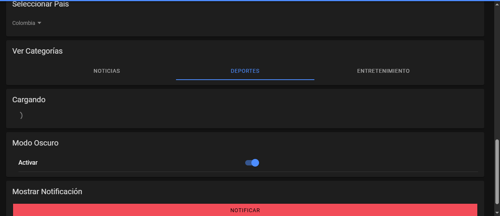
---